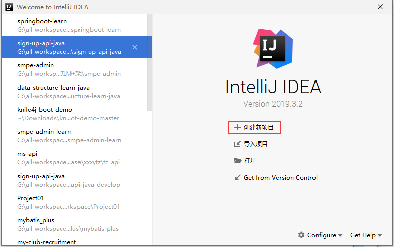
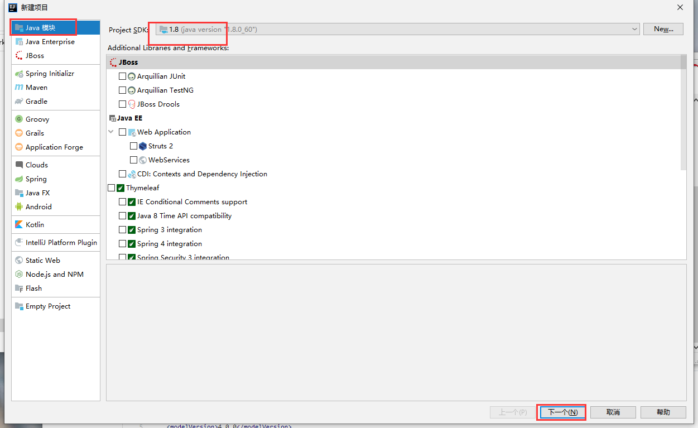
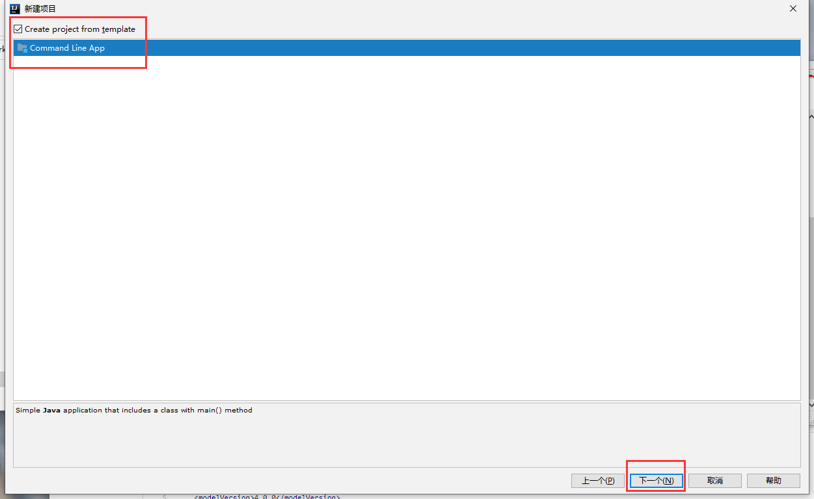
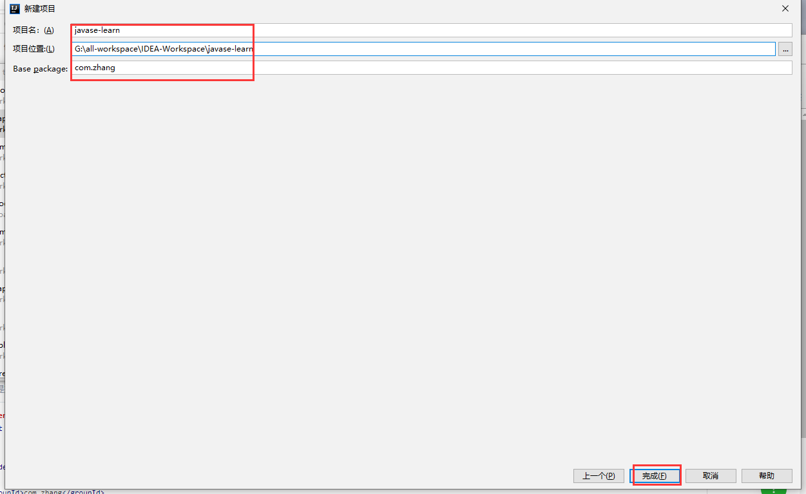
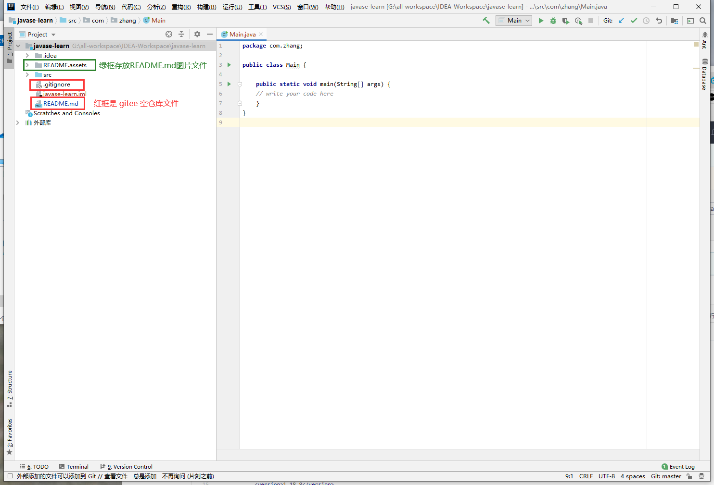
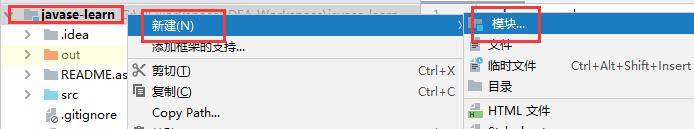
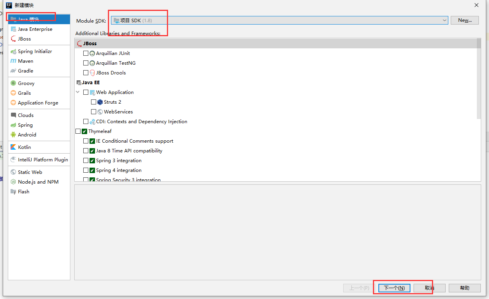
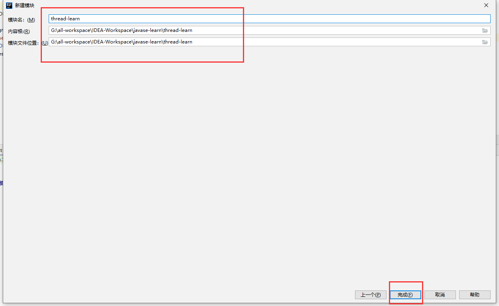

# javase-learn

## 介绍
java基础学习

## 生词

| English      | 中文         |
| ------------ | ------------ |
| deadlock     | 死锁         |
| daemon       | 守护         |
| Join         | 合并（插队） |
| Priority     | 优先权值     |
| state        | 状态（观测） |
| yied         | 礼让         |
| synchronized | 同步         |
| better       | 更好的       |
| tube         | 管道         |
| Signal       | 信号         |

## 新建 JavaSE 项目












## 多线程学习

基于狂神说java

<iframe
        height=850
        height=80%
		src="https://www.bilibili.com/video/BV1V4411p7EF"
        frameborder=0
/>

### 知识梳理-脑图

 <iframe  
     height=850 
     width=90% 
     src="https://www.processon.com/embed/601b6770e0b34d6520d9c8cc"  
     frameborder=0  
 />


### 新建 thread-learn 模块







### 创建线程的三种方法

**实现Runnable接口：推荐使用**

`ImplementsRunnable`

```java
/**
 * ClassName ImplementsRunnable
 * Description TODO 类描述：创建线程方式而：实现 Runnable，重写run方法，执行线程需要丢入 Runnable 接口实现方法，调用 start 方法
 *
 * @author ZhangRenjie
 * Date  2021/2/3 10:32
 */
public class ImplementsRunnable implements Runnable {

    @Override
    public void run() {
        for (int i = 0; i < 200; i++) {
            System.out.println("start : " + i);
        }
    }

    public static void main(String[] args) {

        // 创建 Runnable 接口实现对象
        ImplementsRunnable runnable = new ImplementsRunnable();

        // 创建线程对象，通过线程对象来开启我们的线程，代理
        new Thread(runnable).start();


        for (int i = 0; i < 1000; i++) {
            System.out.println("main : " + i);
        }
    }
}
```

**继承Thread：不推荐，一个类只能实现一个父类，会造成局限性**

`ExtendsThread`

```java
/**
 * ClassName ExtendThread
 * Description TODO 类描述：创建线程方式一：继承 Thread，重写run方法，直接调用 start 或 run 启动线程
 * 总结：线程开启不一定立即执行，需要等待 CPU 调度
 * @author ZhangRenjie
 * Date  2021/2/3 9:33
 */
public class ExtendsThread extends Thread {
    // 创建线程方式一：继承Thread，重写run方法，调用start开启线程

    @Override
    public void run() {
        for (int i = 0; i < 20; i++) {
            System.out.println("run : " + i);
        }
    }

    public static void main(String[] args) {
        // mian 线程，主线程

        // 创建一个线程对象
        ExtendsThread extendThread = new ExtendsThread();
        // 调用 start 方法开启线程，同时执行
//        createThread.start();

        // 调用 run 方法开启线程，先执行 run ，run 执行完了，再执行 main
        extendThread.run();

        for (int i = 0; i < 2000; i++) {
            System.out.println("main : " + i);
        }
    }
}
```

**实现 Callable ：尽量别用，都被淘汰了**

`ImplementsCallable`

```java
import java.util.concurrent.Callable;
import java.util.concurrent.ExecutorService;
import java.util.concurrent.Executors;
import java.util.concurrent.Future;

/**
 * ClassName ImplementsCallable
 * Description TODO 类描述：创建线程方式三：实现 callble 接口，非常不推荐
 *
 * @author ZhangRenjie
 * Date  2021/2/3 11:57
 */
public class ImplementsCallable implements Callable<Boolean> {

    @Override
    public Boolean call() {
        for (int i = 0; i < 20; i++) {
            System.out.println("call : " + i);
        }
        return true;
    }

    public static void main(String[] args) throws Exception {
        ImplementsCallable callable = new ImplementsCallable();
        // 创建执行服务
        ExecutorService ser = Executors.newFixedThreadPool(1);
        // 提交执行
        Future<Boolean> r = ser.submit(callable);
        // 获取结果
        boolean res = r.get();
        // 关闭服务
        ser.shutdownNow();

        for (int i = 0; i < 200; i++) {
            System.out.println("mian : " + i);
        }
    }
}
```

### 线程状态

#### 睡眠 sleep

```java
try {
    Thread.sleep(200);
} catch (InterruptedException e) {
    e.printStackTrace();
}
```

#### 停止 stop

1、建议线程正常停止 --> 利用次数，不建议死循环
2、建议是同标志位置 --> 设置一个标志位
3、不要使用stop 或者 destroy 等过时，或者 JDK 不建议使用的方法

`Stop`

```java
/**
 * ClassName Stop
 * Description TODO 类描述：学习线程的停止 stop
 * 1、建议线程正常停止 --> 利用次数，不建议死循环
 * 2、建议是同标志位置 --> 设置一个标志位
 * 3、不要使用stop 或者 destroy 等过时，或者 JDK 不建议使用的方法
 *
 * @author ZhangRenjie
 * Date  2021/2/3 15:25
 */
public class Stop implements Runnable {

    // 1、设置一个标志位
    private boolean flag = true;

    @Override
    public void run() {
        int i = 0;
        while (flag) {
            System.out.println("runing : " + i++);
        }
    }
    // 2、设置一个公开的方法停止线程，转换标志位
    public void stop() {
        this.flag = false;
    }

    public static void main(String[] args) {
        Stop stop = new Stop();
        new Thread(stop).start();
        for (int i = 0; i < 1000; i++) {
            System.out.println("mian : " + i);
            // 调用 stop 方法切换标志位，让线程停止
            if (i == 900) {
                stop.stop();
                System.out.println("stop");
            }
        }
    }
}
```

#### 合并(插队) Join

合并线程，等待此线程执行完成后，再执行其他线程，其他线程阻塞，可以想想成插队

`Join`

```java
/**
 * ClassName Join
 * Description TODO 类描述：合并线程，等待此线程执行完成后，再执行其他线程，其他线程阻塞，可以想想成插队
 *
 * @author ZhangRenjie
 * Date  2021/2/3 15:52
 */
public class Join implements Runnable {

    @Override
    public void run() {
        for (int i = 0; i < 100; i++) {
            System.out.println("Join : " + i);
        }
    }

    public static void main(String[] args) throws Exception {
        Join join = new Join();
        Thread thread = new Thread(join);
        thread.start();

        for (int i = 0; i < 1000; i++) {
            if (i == 200) {
                // 插队
                thread.join();
            }
            System.out.println("mian : " + i);
        }
    }
}
```

#### 礼让 yield

线程礼让，礼让不一定成果，还得看 cpu 调度

```java
/**
 * ClassName Yied
 * Description TODO 类描述：线程礼让，礼让不一定成果，还得看 cpu 调度
 *
 * @author ZhangRenjie
 * Date  2021/2/3 15:47
 */
public class Yied {
    public static void main(String[] args) {
        MyYied myYied = new MyYied();
        new Thread(myYied, "A").start();
        new Thread(myYied, "B").start();
    }
}

class MyYied implements Runnable {

    @Override
    public void run() {
        System.out.println(Thread.currentThread().getName() + "线程开始执行");
        // 礼让
        Thread.yield();
        System.out.println(Thread.currentThread().getName() + "线程停止执行");
    }
}
```

#### 优先级 Priority

线程优先级，只是给线程分配的资源大一点，但是还是不一定被 cpu 调度

```java
/**
 * ClassName Priority
 * Description TODO 类描述：线程优先级，只是给线程分配的资源大一点，但是还是不一定被 cpu 调度
 *
 * @author ZhangRenjie
 * Date  2021/2/3 16:08
 */
public class Priority {

    public static void main(String[] args) {
        // 主程序默认优先级
        System.out.println(Thread.currentThread().getName() + "-->" + Thread.currentThread().getPriority());

        MyPriority myPriority = new MyPriority();

        Thread t1 = new Thread(myPriority);
        Thread t2 = new Thread(myPriority);
        Thread t3 = new Thread(myPriority);
        Thread t4 = new Thread(myPriority);
        Thread t5 = new Thread(myPriority);
        Thread t6 = new Thread(myPriority);
        // 先设置优先级，再启动
        t1.start();

        t2.setPriority(1);
        t2.start();

        t3.setPriority(4);
        t3.start();

        t4.setPriority(Thread.MAX_PRIORITY);
        t4.start();

        t5.setPriority(-1);
        t5.start();

        t6.setPriority(11);
        t6.start();

    }
}

class MyPriority implements Runnable {

    @Override
    public void run() {
        System.out.println(Thread.currentThread().getName() + "-->" + Thread.currentThread().getPriority());
    }
}
```

守护 daemon

```java
/**
 * ClassName Daemon
 * Description TODO 类描述：线程守护，测试用例：上帝守护你
 *
 * @author ZhangRenjie
 * Date  2021/2/3 16:15
 */
public class Daemon {
    public static void main(String[] args) {
        God god = new God();
        You you = new You();

        Thread thread = new Thread(god);
        // 默认是 false 表示是用户线程，正常的线程都是用户线程
        thread.setDaemon(true);
        // 上帝守护线程启动
        thread.start();
        // 你 用户线程启动
        new Thread(you).start();
    }
}
// 上帝
class God implements Runnable{

    @Override
    public void run() {
        while (true) {
            System.out.println("上帝守护着你");
        }
    }
}
// 你
class You implements Runnable {

    @Override
    public void run() {
        for (int i = 0; i < 16500; i++) {
            System.out.println("you're alive!");
        }
        System.out.println("========goodbye! world!=======");
    }
}
```

### 同步和通信

#### 同步 synchronized

synchronized 和 static 修饰符用法一样，只不过只能用在方法和代码块前边

##### 方法前边

`SafeBuyTicket`

```java
/**
 * ClassName UnsafeBuyTicket
 * Description TODO 类描述：模拟不安全买票，线程不安全，有负数，buy 方法添加 synchronized ，改成安全方法
 *
 * @author ZhangRenjie
 * Date  2021/2/3 16:32
 */
public class SafeBuyTicket {

    public static void main(String[] args) {
        BuyTichet2 buyTichet = new BuyTichet2();
        new Thread(buyTichet, "我").start();
        new Thread(buyTichet, "你").start();
        new Thread(buyTichet, "黄牛").start();
    }
}

class BuyTichet2 implements Runnable {

    // 票
    private int ticketNums = 10;
    // 外部停止线程标志
    boolean flag = true;

    @Override
    public void run() {
        // 买票
        while (flag) {
            try {
                buy();
            } catch (Exception e) {
                e.printStackTrace();
            }
        }
    }
    // synchronized 同步方法，锁住 this
    private synchronized void buy() throws Exception {
        // 判断是否有票
        if (ticketNums <= 0) {
            return;
        }
        // 模拟延迟
        Thread.sleep(100);
        // 买票
        System.out.println(Thread.currentThread().getName() + "买到" + ticketNums--);
    }
}
```

##### 代码前边

`SafeBank`

```java
/**
 * ClassName UnsafeBank
 * Description TODO 类描述：不安全的银行，添加 synchronized 代码块，所住 account
 *
 * @author ZhangRenjie
 * Date  2021/2/3 16:39
 */
public class SafeBank {
    public static void main(String[] args) {
        Account2 account = new Account2(100, "结婚基金");
        Drawing2 you = new Drawing2(account, 50, "你");
        Drawing2 girlFriend = new Drawing2(account, 100, "girlFriend");

        you.start();
        girlFriend.start();
    }
}

// 账户
class Account2{
    // 余额
    int money;
    // 卡号
    String name;

    public Account2(int money, String name) {
        this.money = money;
        this.name = name;
    }
}

// 模拟银行取钱
class Drawing2 extends Thread {
    // 账户
    Account2 account;
    int drawingMoney;
    int nowMoney;

    public Drawing2(Account2 account, int drawingMoney, String name) {
        super(name);
        this.account = account;
        this.drawingMoney = drawingMoney;
    }

    @Override
    public void run() {
        synchronized (account) {
            System.out.println(Thread.currentThread().getName());
            if (account.money - drawingMoney < 0) {
                System.out.println(Thread.currentThread().getName() + "钱不够，取不了");
                return;
            }
            try {
                Thread.sleep(100);
            } catch (InterruptedException e) {
                e.printStackTrace();
            }
            account.money = account.money - drawingMoney;
            nowMoney = nowMoney + drawingMoney;
            System.out.println(account.money + "余额位 : " + account.money);
            System.out.println(this.getName() + "手里的钱" + Thread.currentThread().getName());
        }
    }
}
```

#### 锁

多个线程互相拥有对象需要的资源，然后都不放开资源，然后形成僵持

`Deadlock`

```java
/**
 * ClassName Deadlock
 * Description TODO 类描述：死锁，多个线程互相拥有对象需要的资源，然后都不放开资源，然后形成僵持
 *
 * @author ZhangRenjie
 * Date  2021/2/3 20:58
 */
public class Deadlock {
    public static void main(String[] args) {
        Makeup g1 = new Makeup(0, "灰姑凉");
        Makeup g2 = new Makeup(1, "白雪公主");

        g1.start();
        g2.start();
    }
}

// 口红
class Lipstick {

}
// 镜子
class Mirror {

}

class Makeup extends Thread {

    // 需要的资源只有一份，用static来保证只有一份
    static Lipstick lipstick = new Lipstick();
    static Mirror mirror = new Mirror();

    // 选择
    int choice;
    // 使用化妆品的人
    String girlName;

    Makeup(int choice, String girlName) {
        this.choice = choice;
        this.girlName = girlName;
    }

    @Override
    public void run() {
        // 化妆
        try {
            makeup();
        } catch (Exception e) {
            e.printStackTrace();
        }
    }
    // 化妆，互相持有对方的锁，就是需要拿到对方的资源
    private void makeup() throws Exception {
        if (choice == 0) {
            // 获得口红的锁
            synchronized (lipstick) {
                System.out.println(this.getName() + "获得口红的锁");
                Thread.sleep(1000);
                // 一秒钟后想获得镜子
                synchronized (mirror) {
                    System.out.println(this.getName() + "获得镜子的锁");
                }
            }
        } else {
            // 获得镜子的锁
            synchronized (mirror) {
                System.out.println(this.getName() + "获得镜子的锁");
                Thread.sleep(1000);
                // 一秒钟后想获得口红
                synchronized (lipstick) {
                    System.out.println(this.getName() + "获得口红的锁");
                }
            }
        }
    }
}
```

### 生产者和消费者模型

#### 管程法

利用缓冲区解决

`Tube`

```java
/**
 * ClassName Tube
 * Description TODO 类描述：管程法，生产者消费者模型 --> 利用缓冲区解决
 *
 * @author ZhangRenjie
 * Date  2021/2/4 8:38
 */
public class Tube {

    public static void main(String[] args) {
        SynContainer container = new SynContainer();
        new Producer(container).start();
        new Consumer(container).start();
    }
}
// 生产者
class Producer extends Thread {
    SynContainer container;
    public Producer(SynContainer container) {
        this.container = container;
    }

    @Override
    public void run() {
        for (int i = 0; i < 100; i++) {
            System.out.println("生成了" + i + "只鸡");
            container.push(new Chicken(i));
        }
    }
}
// 消费者
class Consumer extends Thread {

    SynContainer container;
    public Consumer(SynContainer container) {
        this.container = container;
    }

    @Override
    public void run() {
        for (int i = 0; i < 100; i++) {
            System.out.println("消费了 -- >" + container.pop().id + "只鸡");
        }
    }
}
// 产品
class Chicken {
    public Chicken(int id) {
        this.id = id;
    }
    int id;
}
// 缓冲区
class SynContainer {
    // 容器
    Chicken[] chickens = new Chicken[10];
    // 容器计数器
    int count = 0;
    // 生产者放入商品
    public synchronized void push(Chicken chicken) {
        // 如果容器满了，就需要等待消费者消费
        if (count == chickens.length) {
            // 通知消费者消费，生产等待
            try {
                this.wait();
            } catch (Exception e) {
                e.printStackTrace();
            }
        }

        // 如果没有满，就生成并放入
        chickens[count] = chicken;
        count++;
        // 可以通知消费者消费了
        this.notifyAll();
    }

    // 消费者消费产品
    public synchronized Chicken pop() {
        // 判断能否消费
        if (count == 0){
            // 等待生产者生成
            try {
                this.wait();
            } catch (Exception e) {
                e.printStackTrace();
            }
        }
        // 如果可以消费，就消费
        count --;
        Chicken chicken = chickens[count];

        // 消费完，通知生产者
        this.notifyAll();
        return chicken;
    }
}
```

#### 信号灯法

`Signal`信号灯法：唤醒阻塞的线程

```java
/**
 * ClassName Signal
 * Description TODO 类描述：信号灯法：唤醒阻塞的线程
 *
 * @author ZhangRenjie
 * Date  2021/2/4 9:47
 */
public class Signal {
    public static void main(String[] args) {
        TV tv = new TV();
        new Player(tv).start();
        new Watcher(tv).start();
    }
}
// 生产者——演员
class Player extends Thread {
    TV tv;
    public Player(TV tv) {
        this.tv = tv;
    }

    @Override
    public void run() {
        for (int i = 0; i < 20; i++) {
            if (i%2 == 0) {
                this.tv.play("快乐大本营");
            } else {
                this.tv.play("电视剧");
            }
        }
    }
}
// 消费者——观众
class Watcher extends Thread {
    TV tv;
    public Watcher(TV tv) {
        this.tv = tv;
    }

    @Override
    public void run() {
        for (int i = 0; i < 20; i++) {
            tv.watch();
        }
    }
}
// 产品——界面
class TV {
    // 演员表演，观众等待 T
    // 观众观看，演员等待 F
    // 表演的节目
    String voice;
    boolean flag = true;
    // 表演
    public synchronized void play(String voice) {
        if (!flag) {
            try {
                this.wait();
            } catch (Exception e) {
                e.printStackTrace();
            }
        }
        System.out.println("演员表演了 ： " + voice);
        // 通知观众看，通知唤醒
        this.notifyAll();
        this.voice = voice;
        this.flag = !this.flag;
    }
    // 观看
    public synchronized void watch() {
        if (flag) {
            try {
                this.wait();
            } catch (Exception e) {
                e.printStackTrace();
            }
        }
        System.out.println("观看了 : " + voice);
        // 通知演员表演
        this.notifyAll();
        this.flag = !this.flag;
    }
}
```


